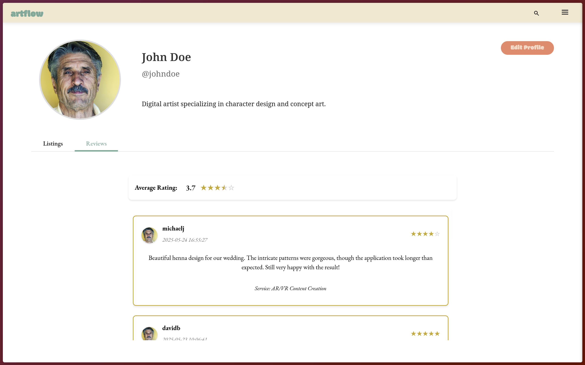
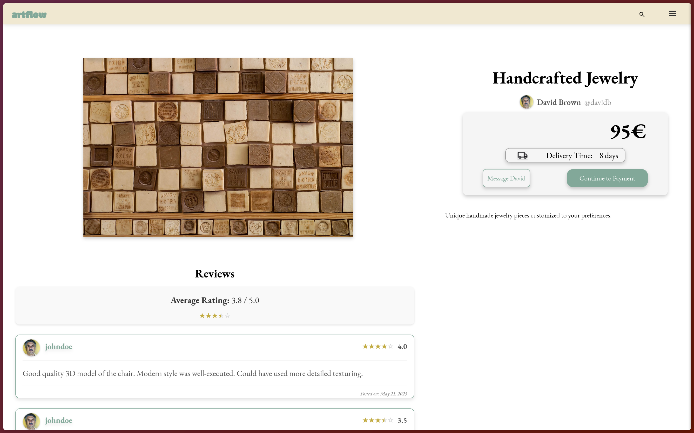
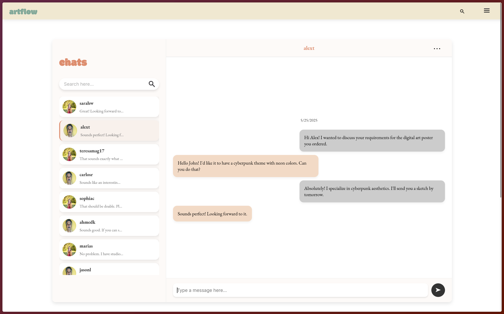
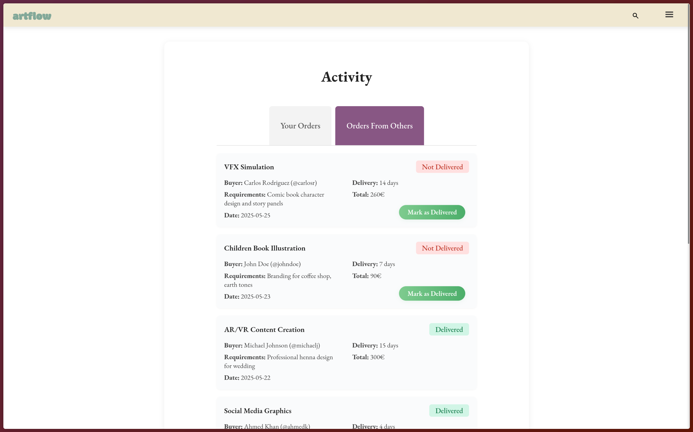
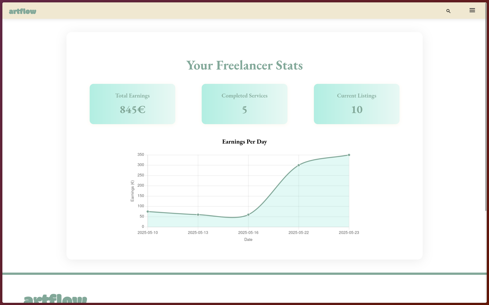
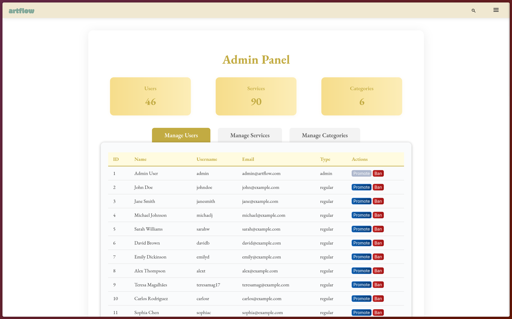
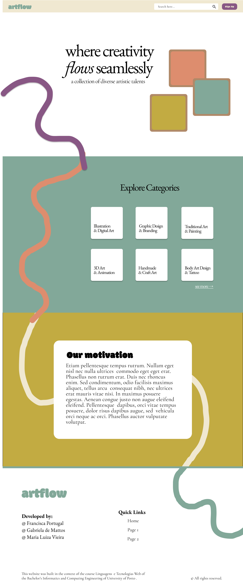
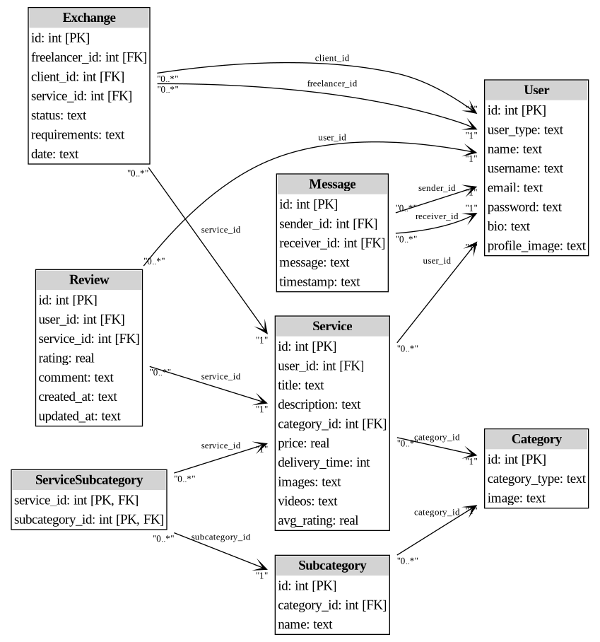

#  artflow

## Where Creativity Flows Seamlessly

<p><strong>artflow</strong> is a freelancing platform exclusively for artists—a place where illustrators, painters, designers, and digital creators can thrive, connect with clients who value authentic work, and earn a fair income from their craft.</p>

## 📋 Table of Contents

- [Project Overview](#project-overview)
- [Features](#features)
- [Screenshots](#screenshots)
- [System Architecture](#system-architecture)
- [Technology Stack](#technology-stack)
- [Installation & Setup](#installation--setup)
- [Demo Accounts](#demo-accounts)
- [Development Team](#development-team)

## Project Overview

In an era where artificial intelligence is rapidly transforming creative industries, many fear that AI-generated art will overshadow human creativity. 'artflow' was created as a response to these concerns—a platform that celebrates and empowers human creativity rather than replacing it.

Our mission is to create a marketplace where artists can:

- Showcase their unique talents and creative services
- Connect directly with clients who value authentic, human-made art
- Maintain control over their work, pricing, and client interactions
- Build sustainable careers in the creative economy

## Features

### User Management

- **Account Creation & Authentication**
  - Register a new account with email verification
  - Secure login/logout system
  - Edit profile information (name, username, password, email)
  - Profile customization with portfolio showcase

### For Freelancers (Artists)

- **Service Management**

  - List creative services with detailed descriptions
  - Set custom pricing, delivery timelines, and service tiers
  - Upload portfolio images and videos
  - Track and manage offered services
  - Analytics dashboard for performance metrics

- **Client Interaction**
  - Direct messaging system with clients
  - Custom quote generation
  - Respond to inquiries and custom order requests
  - Service delivery and completion tracking

### For Clients

- **Service Discovery**

  - Browse services with advanced filtering (category, price, rating)
  - Search functionality with custom preferences
  - Category and subcategory navigation

- **Engagement & Purchases**
  - Direct messaging with freelancers
  - Custom order requests
  - Streamlined checkout process
  - Service rating and review system

### For Administrators

- **Platform Management**
  - User management (promotion, moderation)
  - Service category creation and management
  - Content moderation and quality control
  - System analytics and performance monitoring

### Additional Features

- **Analytics Dashboard:** Performance and sales metrics for freelancers
- **Custom Order System:** Tailored service requests
- **User Preferences:** Personalized search and browsing experience
- **Responsive Design:** Full functionality across desktop and mobile devices
- **Real-time Messaging:** Instant communication between users

## Screenshots

<!--Make it screenshots in the future-->

The application includes several key interfaces:

- **Home Page:** Introduction to the platform
- **Category Pages:** Browse services by creative category
- **Service Detail:** In-depth service information and purchasing
- **User Profiles:** Artist portfolios and client information
- **Messaging System:** Direct communication between users
- **Admin Dashboard:** Platform management tools

**Screenshots:**

<div style="display: flex; justify-content: space-between;">
  
  
  
</div>
<br>
<div style="display: flex; justify-content: space-between;">
  
  
  
  
</div>
<br>
<br>

**Mockups:**

<div style="display: flex; justify-content: space-between;">
  
  
</div>
<br>

<br><br>

## System Architecture

ArtFlow follows a structured MVC-inspired architecture with clear separation of concerns:

- **Database Layer:** SQLite database with comprehensive schema for users, services, orders, and messaging
- **Backend Processing:** PHP-based business logic and data processing
- **Frontend Interface:** Responsive HTML/CSS with JavaScript for interactive elements

Here is the illustrative class diagram of this site:


## Technology Stack

- **Backend:** PHP
- **Database:** SQLite
- **Frontend:** HTML5, CSS3, JavaScript
- **Security:** CSRF protection, password hashing, input validation

## Installation & Setup

1. Clone the repository

   ```
   git clone https://github.com/yourusername/artflow.git
   cd artflow
   ```

2. Set up the database

   ```
   sqlite3 database/database.db < database/database.sql
   sqlite3 database/database.db < database/populate.sql
   ```

3. Start the development server

   ```
   php -S localhost:9000
   ```

4. Access the application at `http://localhost:9000`

## Demo Accounts

For testing purposes, use any of the following accounts:

| Role       | Email             | Password     |
| ---------- | ----------------- | ------------ |
| Admin      | admin@artflow.com | Teresa.mag17 |
| Freelancer | john@example.com  | Teresa.mag17 |

_Additional test accounts available in the credentials section below_

## Development Team

- <a href='https://github.com/franpts2'>Francisca Portugal</a>
- <a href='https://github.com/gab1demattos'>Gabriela de Mattos</a>
- <a href='https://github.com/maluviieira'>Maria Luiza Vieira</a>

---

### Additional Test Credentials

```
jane@example.com / Teresa.mag17
michael@example.com / Teresa.mag17
sarah@example.com / Teresa.mag17
david@example.com / Teresa.mag17
emily@example.com / Teresa.mag17
alex@example.com / Teresa.mag17
teresamag@example.com / Teresa.mag17
carlos@example.com / Teresa.mag17
sophia@example.com / Teresa.mag17
ahmed@example.com / Teresa.mag17
maria@example.com / Teresa.mag17
jason@example.com / Teresa.mag17
nina@example.com / Teresa.mag17
lucas@example.com / Teresa.mag17
emma@example.com / Teresa.mag17
daniel@example.com / Teresa.mag17
isabella@example.com / Teresa.mag17
thomas@example.com / Teresa.mag17
olivia@example.com / Teresa.mag17
ryan@example.com / Teresa.mag17
zoe@example.com / Teresa.mag17
marcus@example.com / Teresa.mag17
rachel@example.com / Teresa.mag17
jwilson@example.com / Teresa.mag17
sophia.m@example.com / Teresa.mag17
adrian.k@example.com / Teresa.mag17
lena.p@example.com / Teresa.mag17
victor.r@example.com / Teresa.mag17
maya.j@example.com / Teresa.mag17
felix.w@example.com / Teresa.mag17
elena.p@example.com / Teresa.mag17
kai.n@example.com / Teresa.mag17
beatrice.s@example.com / Teresa.mag17
hassan.a@example.com / Teresa.mag17
luna.c@example.com / Teresa.mag17
gabriel.s@example.com / Teresa.mag17
nadia.p@example.com / Teresa.mag17
oscar.f@example.com / Teresa.mag17
yuki.t@example.com / Teresa.mag17
leo.c@example.com / Teresa.mag17
alice.b@example.com / Teresa.mag17
marco.r@example.com / Teresa.mag17
priya.k@example.com / Teresa.mag17
system@artflow.com / Teresa.mag17
```

_This project was developed as part of the Linguagens e Tecnologias Web course at the Bachelor's in Informatics and Computing Engineering program at the University of Porto._
